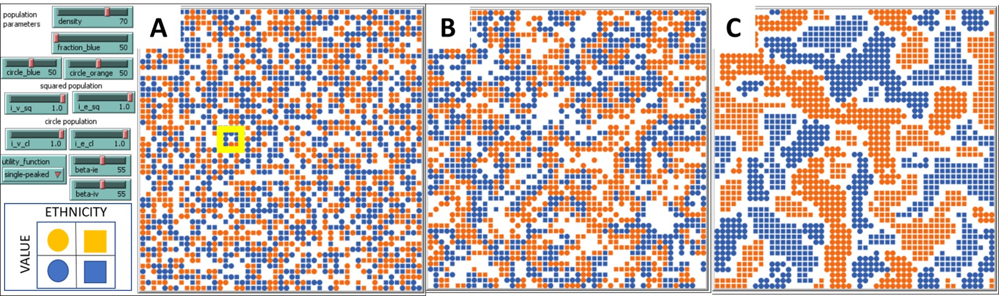

---
output:
  bookdown::pdf_document2:
    toc: false
 #   keep_tex: false
    fig_caption: yes
title: "Integrationist and Segregationist Preferences for Ethnic and Value Neighborhood Composition"
# subtitle: "Target: BIGSSS Research Day"
author: 
    | 
    | Rocco Paolillo 
    | Bremen International Graduate School of Social Sciences
    | University of Bremen & Jacobs University Bremen
    | Mary-Somerville-Str. 9, 28359 Bremen, Germany  
    | rpaolillo@bigsss-bremen.de
# date: JU 
language: en-GB
bibliography: "references.bib"
# always_allow_html: yes

# target: BIGSSS Research Day by September 15th, presented  on October 25th. 6000 words: around 12 pages.
# csl: apa.csl # by default: Chicago style
header-includes:
- \usepackage{float}
- \usepackage{multirow}
- \usepackage{xcolor} 
- \usepackage{amsmath}
- \usepackage{graphicx}

---

```{r setup, include=FALSE}
knitr::opts_chunk$set(echo = TRUE, fig.lp="fig:",warning = FALSE)


# install.packages(c('tinytex', 'rmarkdown', repos = "https://cloud.r-project.org" ))
# tinytex::install_tinytex(force = T)


library(knitr)
library(tidyverse)
library(Hmisc)
library(ggplot2)
library(gridExtra)
library(dplyr)
library(grid)
library(dplyr)
library(reshape2)
library(tidyr)
library(plyr)
library(graphics)
library(xtable)

# To assemble dataset from different experiments run 

# data_same <- read.csv("fragmented_50.csv", sep = ",", skip = 6)
# names(data_same) <- pull(read_csv("manual.csv")) 
# data_majority <- read.csv("fragmented_80.csv", sep = ",", skip = 6)
# names(data_majority) <- pull(read_csv("manual.csv"))
# 
# final <- rbind(data_same,data_majority)
# 
# 
#  write.csv(final, file = "dataset.csv",row.names=FALSE) # later for reproduction

original <-  read.csv("dataset.csv", sep = ",")

data <- original  %>% group_by(density,i_v_cl,i_e_cl,beta_ie,beta_iv,utility_function,i_e_sq,utility_function,circle_blue,i_v_sq,fraction_blue,circle_orange) %>%  summarise_all(mean)


data_equal <- data %>% filter(fraction_blue == 50) %>% filter(i_v_cl == 0.5  |  i_v_cl == 1 ,
                                                              i_e_cl == 0.5  |  i_e_cl == 1, 
                                                              i_v_sq == 0.5  |  i_v_sq == 1,
                                                              i_e_sq == 0.5  |  i_e_sq == 1)

majority_minority <- data %>% filter(fraction_blue == 80) %>% filter(i_v_cl == 0.5  |  i_v_cl == 1 ,
                                                              i_e_cl == 0.5  |  i_e_cl == 1, 
                                                              i_v_sq == 0.5  |  i_v_sq == 1,
                                                              i_e_sq == 0.5  |  i_e_sq == 1)
 

maj_squared <- data %>% filter(fraction_blue == 80) %>% filter(i_v_cl == 0.5  |  i_v_cl == 1 ,
                                                              i_e_cl == 0.5  |  i_e_cl == 1)


equal_squared <- data %>% filter(fraction_blue == 50) %>% filter(i_v_cl == 0.5  |  i_v_cl == 1 ,
                                                              i_e_cl == 0.5  |  i_e_cl == 1)

AFFA <- cbind(maj_squared,equal_squared)


maj_circle <- data %>% filter(fraction_blue == 80) %>% filter(i_v_sq == 0.5  |  i_v_sq == 1 ,
                                                              i_e_sq == 0.5  |  i_e_sq == 1)

equal_circle <- data %>% filter(fraction_blue == 50) %>% filter(i_v_sq == 0.5  |  i_v_sq == 1 ,
                                                              i_e_sq == 0.5  |  i_e_sq == 1)

BEFFA <- cbind(maj_circle,equal_circle)


# Calculation ethnic utility, ask Jan and Andreas to include in the model

 f_eth <- function(i_e,x,n){
  if (x > n){
    U <- NA}else{
    if (x < (n*i_e)){
  U <- (x / (n*i_e))
     }else if (x > (n*i_e)){
        U <- i_e + (((1- (x/n))*(1-i_e))/(1-i_e))
       }else{
    U <- 1}
       round(U,digits = 3)
     }
}

 f_thr <- function(i_e,x,n){
  if (x >= (n*i_e)){
    U <- 1}else{
   U <- 0 }
}
   
   
   
   
   
   
   
   

 # install.packages("tinytex", repos = "https://cloud.r-project.org" ) #, try if debug needed

 
 
```


\abstract{Schelling proposed an influential agent-based model to demonstrate how segregation can emerge from the interaction of people holding ethnic homophily preferences for neighborhood composition and subscribing to a threshold model behavior. In our previous work we extended Schelling by introducing an additional characteristic to agents as value orientation and similarity based on shared values rather than the exclusive category of ethnicity. In this paper, I introduce a binary choice for relocation decision of agents that stems from discrete choice and random utility models. I explore the interaction of agents holding different combinations of integrationist and segregationist preferences for the ethnic composition and value composition of potential neighborhoods both in equal group size and in majority-minority conditions. Results show how segregation persists also for integrationist preferences, but that the interdependence of value and ethnic preferences along with structural conditions as relative group size and distribution of values would generate different patterns on the continuum integration/segregation for different groups. Future directions are discussed.}


# INTRODUCTION {-}

Residential segregation is a topic of interest to diverse disciplines in the social sciences due to its possible effects on reducing contacts between groups [@van2012neighbourhood]. One main research question is on the reasons of observed segregation [@bolt2010linking]. The spatial assimilation theory hypothesizes that the spatial distance between groups reflects their social distance and inequalities [@coulter2019ethnic]. 
Instead, the place stratification theory focuses on the possible strategies of residents to reject newcomers [@horr2018ethnic]. 
While these theories imply that segregation is the outcome of individual intentions, Schelling's model suggests that segregation can emerge as a consequence of the collective behavior of people in a city even without the specific intention to segregate. Thomas Schelling wrote some influential papers in the late 60's observing the residential segregation between white and black population in the U.S.A. [ @schelling1969;@schelling1971;@schelling1978]. 
The main suggestion of Schelling was that the intention of people to leave a neighborhood fits a threshold  model, i.e. people have a desired proportion between in-group and out-group and establish a threshold of tolerance for the presence of the out-group based on it. 
Only when the presence of the other group exceeds such a threshold and the proportion between groups is not desirable, people leave. This scenario has found application into the studies of residential segregation as a tipping point [@card2008tipping], in phenomena such as the white fight [@muller2018residential] and homophily preferences for first neighborhood selection [@magi2016types].
The contribution of Schelling was to demonstrate that even mild preferences for similar ones, regardless of their reasons, could generate  dramatic and stable patterns of spatial segregation [@schelling1969;@clark1991residential].
The reason is the interaction of people trying to satisfy their preferences into spatial constraints due to density of the population, as in the U.S. cities that inspired Schelling's work. Although Schelling showed such dynamics through mathematical tools and graphs, he offered to the scientific community what is nowadays considered one of the first examples of agent-based model. 


In our previous contribution [@paolillo2018], we explored alternatives to the condition in Schelling of similarity based on a "twofold, exhaustive and recognizable distinction" [@schelling1969, 488]. We introduced an alternative to this assumption for several reasons. Theoretically, the perspective of ethnic boundary making challenges the definition of in-group and out-group members as a direct and implicit consequence of ethnic membership [@wimmer2007not;@wimmer2013]. On the contrary, this stream of research focuses on the symbolic and social boundaries between groups built upon the ethnic membership of individuals and that regulate inter-ethnic relations [@bail2008configuration]. The interest of ethnic boundary making is on the mechanisms that generate and administer the definition, inclusion or exclusion of minorities and their members [@wimmer2013;@wimmer2008making]. We considered this approach noteworthy in light of modern and diverse societies where ethnicity can be only one of many categories people belong to [@crul2016super;@verkuyten2004social]. Our goal was to adapt the homophily behavior in Schelling's model to this complexity, and investigate the consequences of definition of similarity independent of ethnic membership. 
We introduced the cross-category of value orientation of agents, conceptualized as tolerance towards diversity. We attributed different homophily preferences to agents based on their value orientation. Intolerant agents subscribed to ethnic homophily preferences, considering as similar the members of their ethnic group [@mcpherson2001birds] independent of their value orientation.
They basically followed the original Schelling's model. Tolerant agents subscribed to value homophily [@fiorina2008political], considering as similar other tolerant agents, independent of their ethnicity. The relocation dynamic due to proportion of similar ones and threshold behavior was the same as in the original Schelling. Additionally, we explored the role of relative group sizes.
This is historically considered the condition for minority groups, which have lower probability to aggregate with similar ones, increasing the assimilation process to majority [@blau1977macrosociological]. As @schelling1971 suggested, this condition has clear implications for segregation dynamics, although only a few simulation studies have addressed explicitly  the role of relative group sizes  [@troitzsch2017axiomatic;@fossett2011generative]. 
We considered this aspect important due to the interdependence of value and ethnic preferences. 
The introduction of value-oriented agents caused a decrease in ethnic segregation compared to the original Schelling's model. Yet, spillover effects emerged, with ethnically mixed neighborhoods formed by tolerant agents becoming attractive to intolerant agents due to the presence of members of their ethnic group. Intolerant agents in the minority condition seemed more sensitive to this dynamic. The consequence of such dynamic was to increase the ethnic homogeneity of neighborhoods filled by intolerant agents.
We explored until which concentration rate tolerant agents would have tolerated intolerant agents before leaving. We linked our work to @esser2010's theoretical model of intergenerational integration. In this rational model, the process of integration of younger migrant generations is theorized as a rational choice between their ethnic context and the receiving context of broader society. Resources and costs to investment are assumed to be the result of the integration of previous generations. Ethnic boundaries and relative group sizes are considered key predictors to the formation of expected utility  of young migrants, and per se they are the consequence of integration of previous generations. One goal of our paper was to link Schelling's framework to this perspective considering residential segregation one outcome of migrant integration [@martone2014immigrant], as well as a predictor to it [@massey1994migration], which can summarize the role of ethnic group sizes and ethnic boundaries in Esser's framework.

In this paper, I present an extension to our model. First, I am interested in the attribution of value preferences and ethnic preferences to all agents. In our previous work we excluded this condition, both to better understand the model and not move too away from Schelling's model for comparison. Letting agents have both ethnic and value homophily preferences is both coherent with the interests stated above and empirically valid. The most important extension of this paper is to model the relocation decision of agents according to random utility models for discrete choice. These models are successfully used in residential studies to connect the characteristics  of neighborhoods selected with the socio-demographic profiles of people  [@borghans2015parental;@boschman2015neighbourhood]. They can contribute to the initialization of agent-based models and their empirical calibration. Additionally, a growing number of studies is already implementing random utility models in Schelling's dynamics [@zhang2004;@xie2012modeling;@bruch2014population]. A famous study in this direction is the one by @bruch2006 which applied random utility models in Schelling and compared the original threshold model with different functional forms of utility, in particular single-peaked function. The conclusion of the study was that linear function would increase integration over segregation. Although it was demonstrated that the conclusion was not corrected [@van2009] and the authors acknowledged for it [@bruch2009preferences], the intuition to use single-peaked function within relocation moves demonstrates more fine-grained scenarios than in the original Schelling. In particular, using the single-peaked function allows to move out of homophily segregationist preferences, but to include the whole range spanning from avoidance of the own group, integrationist preferences between groups and segregationist preferences to the own group. Additionally, some of these studies demonstrate how to link empirical data to calibration of agent-based models estimating preference parameters from random utility models [@xie2012modeling;@bruch2014population]. Adapting our model to this direction seems a promising venue both for theoretical and empirical benefits.

In sum, in this paper I present an extension to our previous work [@paolillo2018] where Schelling's model was extended by introducing the category of value orientation of agents independent of ethnic homophily and exploring the interdependence between value segregation and ethnic segregation. Here I formalize the relocation decision of agents for both value homophily and ethnic homophily within the framework of random utility models for discrete choice. Additionally, I explore the effect of relative group sizes  on such dynamics.


# Method {-}

The core of Schelling's model is to link the micro level of people's preferences to the macro phenomenon of segregation, formalizing the conditions of the emergent system behavior [@schelling1969;@schelling1971;@schelling1978]. Due to this, Schelling's model is considered a paradigmatic case of agent-based modeling [@epstein1996growing;@hatna2012schelling]. As a method, agent-based models are computer simulations able to reproduce complex systems as a society and its components, called agents, which can represent people with preferences, together with the contextual conditions of their interactions such as density of the population. The main advantage of the method is to link the individual behavior of agents (micro level) with the emergent behavior of the society (macro level) [@gilbert2005simulation]. To understand the emergence of complex phenomena as segregation, researchers can manipulate preferences people want to maximize and the context of their actions, observing the outcome of manipulation and adjust to the formalization of the mechanisms.

The agent-based model I present shows a city where agents relocate according to their neighborhood preferences, which depend on the proportion of agents with the same ethnicity and the same value orientation. At each step, an agent compares its current location to an alternative one, with the intention to select the neighborhood that maximizes its preferences. The process is modeled as a binary choice between two discrete options and fits the paradigm of random utility models. According to discrete choice, when people choose between two options, they will select the one which has the highest utility, i.e. desirability [@bruch2009preferences;@manski1977structure]. Utility of options depends on their characteristics and how they are assessed by people preferences [@mcfadden2001economic]. In this paper, the options agents assess are neighborhoods, and utility refers to the maximization of homophily preferences.

The way agents rank the desirability of different neighborhoods depends on the functional forms implemented. In this paper, I use the single-peaked function, according to which agents have an ideal point, i.e. the desired concentration of similar ones for each dimension, and use this to rank the utility of neighborhoods. Annex A shows the single-peaked function used for each desired concentration. Utility $U \in[0,1]$ is linearly increasing when its value or ethnic concentration gets closer to the ideal point and reaches the max utility peak $U=1$ when the concentration of a neighborhood is equal to the ideal point. Utility of neighborhoods whose concentration exceeds the ideal concentration is linearly decreasing. The single-peaked function I formulated is a simplification of the one used by @zhang2011. I derive the right slope of decreasing utility from the ideal point itself, as follows:


$$
U=
\begin{cases}
(\frac{x}{n \times i_e}), & \text{if} \ x <= n\times i_e, \\
\\
i_e + \frac{(1 - \frac{x}{n}) \times (1 - i_e)}{1 - i_e}, & \text{if} \ x > n\times i_e 
\end{cases}
$$
where: \par
- $U$: utility of a neighborhood
- $x$: number of similar agents in the neighborhood
- $n$: total number of agents in the neighborhood
- $i_e$: desired composition of similar ones

The same applies for ethnic utility $U_e$ ($x$ = agents with same ethnicity), and value utility $U_v$ ($x$ = agents with same value orientation). \par

A classical paradigm of utility maximization would assume that the probability for an agent to leave its current neighborhood is certain once the utility of the alternative location exceeds the current one:


$$
P_{alternative}=U_{alternative} -  U_{current}
$$
where: \par
- $P_{alternative}=1$ means moving to the alternative neighborhood, implying its utility is higher than the current one
- $P_{alternative}=0$ means staying on the current location, implying its utility is higher than the alternative

The same for current neighborhood chosen over the alternative one. \par
\par

This would imply that the best option is always selected, and that observed characteristics are the only attributes that influence the choice of people [@bruch2009preferences]. The paradigm of random utility models relaxes this assumption. The key concept is that the real processes behind the decision of people are unknown, and the utility maximization assumption can be only an approximation of those processes [@hess2018revisiting]. Each decision made is considered to consist of both a systematic component of utility and a random term [@bruch2009preferences; @train2009discrete;@manski1977structure]. The systematic component of utility refers to the observed differences between options and how they are assessed. It is the equivalent of $U_e$ and $U_v$ calculated. The random term represents other characteristics of the option, of the selector, or interaction of both, which can influence the choice in addition  to systematic differences in utility but are unknown. To calculate whether the choice was due to the systematic differences in utility or due to random term, each dimension of utility is weighted by a parameter of determinism $\beta\in[0,\infty)$: $\beta_e$ for $U_e$ and $\beta_v$ for $U_v$. The higher the $\beta$ for each dimension of utility, the lower is the effect of the random term in the decision outcome compared to that dimension, so that only the  differences observed for that dimension matter, and the best option is taken. $\beta = 0$ for one dimension means that systematic differences in utility for that dimension do not matter, and all options have equal probability to be selected due to higher effect of the random term. The probability to select the alternative neighborhood then becomes:


$$
P_{alternative}   = \beta_e U_e + \beta_v U_v  + \epsilon
$$
where: \par
- $P_{alternative}$: probability to select the alternative neighbohrood
- $\beta_e U_e$: parameter for ethnic utility times the ethnic utility attributed to alternative
- $\beta_v U_v$: parameter for value utility times the value utility attributed to alternative
- $\epsilon$: random term for the selection of alternative neighborhood \par

The same for current neighborhood.\par

$\beta_e U_e + \beta_v U_v$ represents the deterministic component in the relocation decision. Parameters $\beta$ are basically the equivalent of the coefficient of regression that can be estimated from the choice people made and related  to their characteristics. The contribution of @mcfadden1973conditional and his conditional logit to random utility models was to elaborate a formula to calculate the probability to select one option over the others from estimation of $\beta$ once it is assumed that the random term $\epsilon$ is unknown to the researcher and cannot be estimated. The necessary assumption is that the random term is independent and identically distributed among the alternatives (i.i.d.), so that only difference in observed characteristics will influence the relocation process [@train2009discrete]. To fit such condition, it is assumed that random terms are distributed according to an extreme value distribution, generally a Gumbel distribution [@hess2018revisiting;@manski1977structure]. The probability for an option $j$ to be selected out of a set of options $k$ is:


$$
P_{j}=\frac{\exp(\beta_e U_e + \beta_v U_v)}{\sum\exp(\beta_e U^k_e + \beta_v U^k_v)}
$$

The same for each option $k$.\par
\par

The exponential function serves to satisfy the assumption that random term has extreme value distribution. The particularity of this equation is that not necessarily the best option is selected, neither any option has probability completely equal 0. Still, when $\beta$ is high, options with higher utility $U$ for that dimension have higher chance to be selected. For $\beta=0$, each option has same probability to be selected, not matter the difference in utility $U$ for that dimension. This formula is considered the "mother logit formula" [@hess2018revisiting, p.186] for random utility models in discrete choice decisions. In the case of agent-based modeling, the final decision is modeled by throwing a random-float number $r \in[0,1]$ and compare the computed probability for each option to it. The option whose probability is higher than $r$ is selected [@bruch2012methodological]. In my model, I use a simplified version of @mcfadden1973conditional's formula for binary logit, and calculate it  oly for the alternative options to relocate to. My decision is because  if the alternative option is not selected, the agent doesn't move from its current location. This would be the same of probability for current location higher than the alternative. Since the relocation choice is continuously reiterated, the number of options at each choice does not influence the final emerging result, as tested in the model and common practice in computational work [@bruch2006;@zhang2004]. \par
The probability of an agent to relocate to the alternative location is:

$$
P_{alternative}=\frac{1}{1 + \exp((\beta_eU^{cr}_e + \beta_vU^{cr}_v) - (\beta_eU^{al}_e + \beta_vU^{al}_v))}
$$
where: \par
- $\beta_eU^{cr}_e + \beta_vU^{cr}_v$: systematic utility of current location as sum of ethnic utility and value utility, times the relative $\beta$
- $\beta_eU^{al}_e + \beta_vU^{al}_v$: systematic utility of alternative location as sum of ethnic utility and value utility, times the relative $\beta$

The same for current location, not calculated here.\par
\par
@train2009discrete (p. 39) demonstrates how this is the equivalent of @mcfadden1973conditional's formula for two options. 

# Model and Experiments {-}

The model^[The model can be found here:https://github.com/RoccoPaolillo/BIGSSS_ResearchDay.git] is built in NetLogo 6.1.0, a programmable modeling environment [@Wilenskynl] and extends the Schelling version available to users [@Wilenskysm]. The model represents a grid where each point, called node, can host only one agent, or being empty. An agent represents a person choosing which node to relocate to based on the characteristics of its neighborhood. The neighborhood is modeled as a Moore distance, i.e. the 8 nodes surrounding the potential node. An agent is characterized by two attributes: ethnicity and value orientation. Ethnicity is modeled through color of agents, value orientation through their shape. Two ethnic groups live in the society, *blue* population and *orange* population. Each agent has a value orientation, which can be either *square* or *circle*. In total, 4 subgroups of agents relocate in the city: square blue, square orange, circle blue, circle orange. See Fig: \ref{fig:interfacefig} for the interface and graphical summary of the model. A parameter regulates the density of the overall population of agents, with the probability for each node to host an agent at time 0.  Ethnic relative group size is implemented with the probability for each agent to belong to the majority group (blue) or minority (orange), regulated by tunable parameters. Finally, two independent parameters regulate the probability for agents to belong either to value square orientation or circle value orientation.\par


```{r interfacefig, fig.pos ='h!',out.width='90%',out.height='90%',fig.show='hold',fig.align='center', fig.cap= "Interface of the model for initial even distribution of ethnic group sizes. A: scenario at time 0 with not relocation, tunable parameters are on the left and the city on the  right. In the box the four types of agents from the intersection of ethnicity and value orientation. The yellow marked area is the neighborhood defined by the Moore distance for the empty white node, and whose ethnic and value utility is calculated. B: Simulation run with integrationist preferences for all agents on ethnic and value composition. C: Simulation run with segregationist preferences for all agents on ethnic and value composition.",  echo = FALSE, include=TRUE}

```


Agents calculate $U_e$ and $U_v$ depending on their value orientation (shape). Value utility $U_v$ refers to the desired concentration of agents in the neighborhood with the same value of the selector (the shape), regardless of their ethnicity (the color). Ethnic utility $U_e$ refers to desired the concentration of agents in the neighborhood with the same ethnicity (the color), regardless of their value orientation (the shape). 4 parameters regulate the systematic component of utility for each value orientation group (circle and square, independent of ethnicity):

* $ie$: desired concentration for ethnic utility $U_e$
* $iv$: desired concentration for value utility $U_v$
* $\beta_e$: parameter of determinism for ethnic utility $U_e$
* $\beta_v$: parameter of determinism for value utility $U_v$

Name of the parameters slightly differ in the model. For simplification of the model, $\beta_e$ and $\beta_v$ are unique for all agents. This does not affect the dynamics of the model. Table below summarizes agents' characteristics and experiments setup. 

At each step, a random agent compares the neighborhood of its current location to the neighborhood of a potential empty node according to its preferences for ethnic and value composition. According to computed probability $P_{alternative}$, it decides whether to move or not. An empty neighborhood has $U=0$: given the neighborhood composition preferences, agents aim at living in inhabited neighborhoods. The relocation outcome will influence the neighborhood characteristics for the next agent to move. Desired composition for ethnic utility and value utility ranges from $0$ to $1$ in step $0,1$. A desired concentration $0$ means totally assimilationist attitudes, no one of the same group is desired in the neighborhood, and represents a linearly decreasing function. $0.5$ represents integrationist preferences: max utility is given to neighborhoods where both groups are evenly distributed. Finally, $1$ represents full segregationist preferences: agents strive for a neighborhood fully homogeneous and represents a linear increasing function. See Appendix A for the whole range of desired concentration and single-peaked function. 

To the aim to explore the two extreme cases belonging to the integration/segregation nexus, and for the sake of simplicity, I select in the observations the cases for integrationist and segregationist preferences for both ethnic composition and value composition:

For each value orientation group, 4 conditions are thus explored:

* ethnic integrationist preference, value integrationist preference
* ethnic integrationist preference, value segregationist preference
* ethnic segregationist preference, value integrationist preference
* ethnic segregationist preference, value segregationist preference

\par

In APPENDIX B, I use heatmaps to explore more fine-grained scenarios. The original dataset includes the range for desired ethnic concentration $ie \in[0,0.3,0.5,0.7,1]$ and for desired value concentration $iv \in[0,0.3,0.5,0.7,1]$  for both square and circle group. \par

Additionally, I explore such preferences within two conditions for ethnic relative group sizes:

* equal group sizes: ratio blue agents/orange agents = 0.5
* majority-minority: ratio blue agents/orange agents = 0.8

\par

I keep as fixed parameters the density of population at $70\%$ (roughly $1800$ agents), parameters $\beta = 55$ for both ethnic and value composition for all agents, even distribution of value orientation within each ethnic group ($50\%$). \par

As output of the model, I observe the ethnic segregation $\Theta^\text{E}$ and value segregation $\Theta^\text{V}$  emerging from each condition. They both are calculated as proportion of agents of the same color (ethnic segregation) or same shape (value segregation) in the neighborhood of the agent. The index of segregation is a common exposure index, and ranges from 0 (no similar agents in the neighborhood), to 1 (fully segregated neighborhood). Not all 8 nodes  of the neighborhood need to be filled to calculate the segregation index. Table below synthetizes model parameters and experiments setup.

In total, 1.250 experimental conditions were collected, each repeated 5 times, for a total amount of 6250 runs. I let the simulation run for $1000$ steps. The behavior of agents in NetLogo is asynchronous, meaning that one agent randomly selected executes the behavior, and only when it completes the procedure, another agent starts the same procedure, and so until all agents undergo the procedure. I take $1000$ steps as a fair amount of time for all agents to relocate several times and observe stable patterns of segregation. I collapse the results on their average.


\begin{table}
\begin{tabular}{lll}
\midrule
 Static agent variable                      & Range         &                      \\ \midrule
 Ethnicity  (\textit{color})         & Blue, Orange        \\
 Value orientation (\textit{shape}) & Square, Circle \\\midrule
 
 Population parameters    & Range   & Experiments  \\ \midrule
 Population density                     & 0.5--0.99   & 0.7          \\
 Fraction of majority ethnicity (blue)  & 0.5--1      & $0.5;0.8$  \\
Fraction of circle blue ethnicity  & 0--1      & $0.5$  \\
Fraction of circle orange ethnicity & 0--1      & $0.5$   \\\midrule

 Parameters for relocation choice, square    & Range   & Experiments  \\ \midrule
 Desired ethnic concentration & [0,1]   & $0,0.3,0.5,0.7,1$ \\
 Desired value concentration & [0,1]   & $0,0.3,0.5,0.7,1$ \\
 Beta ethnic utility & [0,100] & 55 \\
 Beta value utility & [0,100] & 55 \\ \midrule
 Parameters for relocation choice, circle    & Range   & Experiments  \\ \midrule
  Desired ethnic concentration & [0,1]   & $0,0.3,0.5,0.7,1$ \\
 Desired value concentration & [0,1]   & $0,0.3,0.5,0.7,1$ \\
 Beta ethnic utility & [0,100] & 55 \\
 Beta value utility & [0,100] & 55 \\
 
 \midrule
 

 Global output measures    & Computation & Range  \\ \midrule
 Ethnic segregation $\Theta^\text{E}$   & same color neighborhood proportion & $0,\stackrel{+0.1}{\dots}, 1$ \\
  Value segregation $\Theta^\text{V}$   & same shape neighborhood proportion & $0,\stackrel{+0.1}{\dots}, 1$ \\
   \midrule
\end{tabular}
\label{tab:summary}
 \caption{Model characteristics and experiment setup} 


\end{table}


 <!-- Ethnic segregation $\Theta^\text{E}$   & same color neighborhood proportion & $0,\stackrel{+0.1}{\dots}, 1$ \\ -->
 <!--  Value segregation $\Theta^\text{V}$   & same shape neighborhood proportion & $0,\stackrel{+0.1}{\dots}, 1$ \\ -->


# Results {-}

In Fig: \ref{fig:global} to Fig: \ref{fig:circleMAJ}, I compare the consequences of integrationist and segregationist attitude of agents for ethnic and value neighborhood composition. Emergent outcomes whose average is reported are ethnic segregation $\Theta^\text{E}$ and value segregation $\Theta^\text{V}$. I first explore the results at the population level, then for square value group and circle value group. For both equal group size condition and majority-minority condition, results in graph are compared with the baseline segregation due to initial conditions: $0.5$ for ethnic equal group size and $0.68$ for ethnic majority-minority condition. As we used in @paolillo2018, baseline is calculated as $x\cdot x + (1-x)\cdot (1-x)$, where $x$ is the reference fraction, here $x = 0.5$ for equal group size, $x = 0.8$ for majority-minority condition. Each  box represents the intersection of ethnic and value preferences of agents. On the x-axis is the ethnic preference for square group, on the right side the value preferences for the square group. Each box is faceted for ethnic and value preferences of circle group.

Fig: \ref{fig:global} shows the global segregation for conditions of equal group sizes. In all conditions, the average segregation is higher than the one expected from the baseline segregation due to even distribution of groups $\Theta^\text{E} = 0.5$. Interesting, this happens even in the case of all agents have integrationist preferences both for value and ethnic composition of the neighborhood (first box upper row), with $\Theta^\text{E} = `r data %>%  filter(fraction_blue == 50 & i_e_sq == 0.5 & i_v_sq == 0.5 & i_e_cl == 0.5 & i_v_cl == 0.5) %>% pull(eth_seg_gl) %>% round(digits=2)`$ and $\Theta^\text{V} = `r data %>%  filter(fraction_blue == 50 & i_e_sq == 0.5 & i_v_sq == 0.5 & i_e_cl == 0.5 & i_v_cl == 0.5) %>% pull(val_seg_gl) %>% round(digits=2)`$. Although this is the lower level of segregation, this result shows how the intuition that all integrationist attitudes both for value and ethnic composition would favor integration over segregation would not stand, even starting from an even distribution of groups. An interesting observation is the upper row from Fig: \ref{fig:global} where square agents hold integrationist preferences ($50\%$) for the value composition of the neighborhood. When square agents increase their ethnic preferences from integrationist to full segregationist preferences for ethnically homogeneous neighborhoods, then the value segregation (green line) decreases. This is more evident when also the circle group moves to more ethnic segregationist preferences ($100\%$ Ethnic Circle). In the condition where circle group holds value integrationist preferences ($50\%$ Value Circle), value segregation decreases from $\Theta^\text{V} = `r data %>%  filter(fraction_blue == 50 & i_e_sq == 0.5 & i_v_sq == 0.5 & i_e_cl == 1 & i_v_cl == 0.5) %>% pull(val_seg_gl) %>% round(digits=2)`$ to $\Theta^\text{V} = `r data %>%  filter(fraction_blue == 50 & i_e_sq == 1 & i_v_sq == 0.5 & i_e_cl == 1 & i_v_cl == 0.5) %>% pull(val_seg_gl) %>% round(digits=2)`$ when square agents increase their ethnic segregationist preferences to $100\%$. In the condition where also the circle group holds value segregationist preferences ($100\%$ Value Circle), value segregation decreases from $\Theta^\text{V} = `r data %>%  filter(fraction_blue == 50 & i_e_sq == 0.5 & i_v_sq == 0.5 & i_e_cl == 1 & i_v_cl == 1) %>% pull(val_seg_gl) %>% round(digits=2)`$ to $\Theta^\text{V} = `r data %>%  filter(fraction_blue == 50 & i_e_sq == 1 & i_v_sq == 0.5 & i_e_cl == 1 & i_v_cl == 1) %>% pull(val_seg_gl) %>% round(digits=2)`$ when square group increases ethnic segregationist preferences to $100\%$. The same trend seems to not appear for the same conditions in Fig: \ref{fig:globalmin} of majority-minority conditons between groups.

```{r  global, fig.pos ='H',out.width="60%",out.height="40%",fig.align='center', fig.cap= "Global Segregation in equal group sizes. Dotted red line: baseline ethnic segregation: 0.5. Dotted blue line: baseline value segregation: 0.50",out.width='\\textwidth', echo = FALSE}


 i_e_cl.labs <- c("50% \n Ethnic Circle", "100% \n Ethnic Circle")
names(i_e_cl.labs) <- c("0.5", "1")
i_v_sq.labs <- c(" 50% \n Value Square ", " 100% \n Value Square ")
names(i_v_sq.labs) <- c("0.5", "1")
i_v_cl.labs <- c(" 50% \n Value Circle", "100% \n Value Circle")
names(i_v_cl.labs) <- c("0.5","1")


gl_eq <- data_equal %>%  gather(key = subgroup, value = Fraction, eth_seg_gl,val_seg_gl) %>% 
  mutate(
    subgroup = factor(subgroup, levels = c("eth_seg_gl","val_seg_gl"), labels=c("Ethnic Segregation","Value Segregation"))) %>%

  ggplot(aes(x = i_e_sq, y = Fraction, color = `subgroup`)) + geom_line(size = 1)  + facet_grid( i_v_sq ~  i_v_cl + i_e_cl, labeller = labeller(i_e_cl = i_e_cl.labs, i_v_cl = i_v_cl.labs, i_v_sq = i_v_sq.labs))  +  coord_fixed(ratio = 0.6)   + ylab("") + xlab("Ethnic Square") +	scale_color_manual(values=c("dark violet", "dark green"), guide = guide_legend(title=""))  +
  scale_linetype_manual(values = c("solid","dashed"), guide = guide_legend(title="")) +
 scale_x_continuous(limits = c(0.5,1), breaks=c(0.5,1), labels=c("50%", "100%     "))  +
  scale_y_continuous(limits = c(0,1), breaks=seq(0, 1, by = 0.1)) + 
  geom_hline(yintercept = 0.5, color = "red", linetype = "dotted", size  = 1.4) +
    geom_hline(yintercept = 0.5, color = "blue", linetype = "dotted", size  = 0.9) +
 # ggtitle("50% Value Circle")  +
	theme_bw() + theme(legend.position = "bottom",	panel.grid.minor.x = element_blank(),
		panel.grid.minor.y = element_blank(), legend.margin=margin(0,0,0,0),
		plot.title = element_text(hjust = 0.5), panel.spacing = unit(1, "lines") ) 

gl_eq


```


```{r  globalmin,fig.pos ='H',out.width="60%",out.height="40%",fig.align='center',   fig.cap= "Global Segregation in majority-minority condition. Dotted red line: baseline ethnic segregation: 0.68. Dotted blue line: baseline value segregation: 0.50",out.width='\\textwidth', echo = FALSE, include = TRUE}


 i_e_cl.labs <- c("50% \n Ethnic Circle", "100% \n Ethnic Circle")
names(i_e_cl.labs) <- c("0.5", "1")
i_v_sq.labs <- c(" 50% \n Value Square ", " 100% \n Value Square ")
names(i_v_sq.labs) <- c("0.5", "1")
i_v_cl.labs <- c(" 50% \n Value Circle", "100% \n Value Circle")
names(i_v_cl.labs) <- c("0.5","1")


gl_mj <- majority_minority %>%  gather(key = subgroup, value = Fraction, eth_seg_gl,val_seg_gl) %>% 
  mutate(
    subgroup = factor(subgroup, levels = c("eth_seg_gl","val_seg_gl"), labels=c("Ethnic Segregation","Value Segregation"))) %>%

  ggplot(aes(x = i_e_sq, y = Fraction, color = `subgroup`)) + geom_line(size = 1)  + facet_grid( i_v_sq ~  i_v_cl + i_e_cl, labeller = labeller(i_e_cl = i_e_cl.labs, i_v_cl = i_v_cl.labs, i_v_sq = i_v_sq.labs))  +  coord_fixed(ratio = 0.6)   + ylab("") + xlab("Ethnic Square") +	scale_color_manual(values=c("dark violet", "dark green"), guide = guide_legend(title=""))  +
  scale_linetype_manual(values = c("solid","dashed"), guide = guide_legend(title="")) +
 scale_x_continuous(limits = c(0.5,1), breaks=c(0.5,1), labels=c("50%", "100%     "))  +
  scale_y_continuous(limits = c(0,1), breaks=seq(0, 1, by = 0.1)) + 
 
  geom_hline(yintercept = 0.68, color = "red", linetype = "dotted", size  = 1.4) +
    geom_hline(yintercept = 0.5, color = "blue", linetype = "dotted", size  = 0.9) +
 # ggtitle("50% Value Circle")  +
	theme_bw() + theme(legend.position = "bottom",	panel.grid.minor.x = element_blank(),
		panel.grid.minor.y = element_blank(), legend.margin=margin(0,0,0,0),
		plot.title = element_text(hjust = 0.5), panel.spacing = unit(1, "lines") ) 

gl_mj

```


Fig: \ref{fig:equal} explores the segregation scenarios for the square and circle group, independent of their ethnic membership. Value segregation follows the same trend for the two group, unsurprising considering that each value orientation group represents the $50\%$ of the global population. The most noteworthy observation is the third box on upper row. Here circle group holds integrationist preferences for ethnic dimension ($50\%$ Ethnic Circle), and segregationist preferences for the value dimension ($100\%$ Value Circle). The increase of segregationist ethnic preferences for square agents to $100\%$ causes decrease of ethnic segregation for the circle group rather than an increase, from $\Theta^\text{E} = `r data %>%  filter(fraction_blue == 50 & i_e_sq == 0.5 & i_v_sq == 0.5 & i_e_cl == 0.5 & i_v_cl == 1) %>% pull(eth_seg_crl) %>% round(digits=2)`$ to $\Theta^\text{E} = `r data %>%  filter(fraction_blue == 50 & i_e_sq == 1 & i_v_sq == 0.5 & i_e_cl == 0.5 & i_v_cl == 1) %>% pull(eth_seg_crl) %>% round(digits=2)`$ for segregationist ethnic preferences of square group ($100\%$ Ethnic Square). In this condition each subgroup (ethnicity X value) represents the $25\%$ of the population. The trend of ethnic segregation increases for the square group, while ethnic segregation for circle group decreases, and value segregation for both groups is stable. The result can thus be interpreted that circle population creates robust value homogenous and ethnically integrated neighborhoods. These neighborhoods attract square population with full ethnic segregationist preferences, since they have higher chance to find co-ethnics of different value orientation, which satisfies the value integrationist references of square population as well. The circle population with full value segregationist preferences would be resilient enough to host square population because of the majority condition. The consequence of square ethnic  segregationist newcomers is that the ethnic segregation of circle population decreases. Basically, in this condition every agent is likely to maximize their preferences. 

```{r  equal,fig.pos ='H',out.width="60%",out.height="40%",fig.align='center',   fig.cap= "Segregation for square and circle group in equal group sizes. Dotted red line: baseline ethnic segregation: 0.5. Dotted blue line: baseline value segregation: 0.50",out.width='\\textwidth', echo = FALSE, include = TRUE}


 i_e_cl.labs <- c("50% \n Ethnic Circle", "100% \n Ethnic Circle")
names(i_e_cl.labs) <- c("0.5", "1")
i_v_sq.labs <- c(" 50% \n Value Square ", " 100% \n Value Square ")
names(i_v_sq.labs) <- c("0.5", "1")
i_v_cl.labs <- c(" 50% \n Value Circle", "100% \n Value Circle")
names(i_v_cl.labs) <- c("0.5","1")


val_50 <- data_equal %>%   gather(key = subgroup, value = Fraction, eth_seg_sqr,eth_seg_crl,val_seg_sqr,val_seg_crl) %>% 
  mutate(
    `segregation` = fct_relevel(fct_collapse(subgroup, `Ethnic Segregation` = c("eth_seg_sqr","eth_seg_crl"), `Value Segregation` = c("val_seg_sqr","val_seg_crl")),"Ethnic Segregation"),
         `Group` = fct_relevel(fct_collapse(subgroup,`Square` = c("eth_seg_sqr","val_seg_sqr"), `Circle` = c("eth_seg_crl","val_seg_crl")),"Square")) %>%

  ggplot(aes(x = i_e_sq, y = Fraction, color = `segregation`, linetype = `Group`)) + geom_line(size = 1)  + facet_grid( i_v_sq ~  i_v_cl + i_e_cl, labeller = labeller(i_e_cl = i_e_cl.labs, i_v_cl = i_v_cl.labs, i_v_sq = i_v_sq.labs))  +  coord_fixed(ratio = 0.6)   + ylab("") + xlab("Ethnic Square") +	scale_color_manual(values=c("dark violet", "dark green"), guide = guide_legend(title=""))  +
  scale_linetype_manual(values = c("solid","dashed"), guide = guide_legend(title="")) +
 scale_x_continuous(limits = c(0.5,1), breaks=c(0.5,1), labels=c("50%", "100%     "))  +
  scale_y_continuous(limits = c(0,1), breaks=seq(0, 1, by = 0.1)) + 

  geom_hline(yintercept = 0.5, color = "red", linetype = "dotted", size  = 1.4) +
    geom_hline(yintercept = 0.5, color = "blue", linetype = "dotted", size  = 0.9) +
#  ggtitle("50% Value Circle")  +
	theme_bw() + theme(legend.position = "bottom",	panel.grid.minor.x = element_blank(),
		panel.grid.minor.y = element_blank(), legend.margin=margin(0,0,0,0),
		plot.title = element_text(hjust = 0.5), panel.spacing = unit(1, "lines") ) 

val_50
 

```


Fig: \ref{fig:squaredMAJ} and Fig: \ref{fig:circleMAJ} explore the segregation patterns of square and circle group when in the majority or minority condition. For both ethnic  majority ($80\%$ of population) and ethnic minority ($20\%$ of population), circle agents represent the $50\%$. To show the consequence of this condition, I invert the graphs as shown by labels: each box refers to the reference group whose behavior is shown, and they are faceted by the preferences of the other group. The only difference that emerges between circle and square is for agents in the minority condition. Here they show different segregation outcomes when shifting to full segregationist ethnic preferences if they belong to circle or square group, as shown in Fig: \ref{fig:squaredMAJ} and Fig: \ref{fig:circleMAJ}. Minority square (Fig: \ref{fig:squaredMAJ}) decrease value segregation, whereas value segregation for minority circle does not differ (Fig: \ref{fig:circleMAJ}). Moreover, ethnic segregation of circle group is higher. 
When squared minority agents shift from ethnic integrationist to ethnic segregationist preferences, they need to segregate with circle agents of the own ethnic group in order to maximize their segregationist preferences, which has a direct effect on reducing their value segregation (from $\Theta^\text{V} = `r data %>%  filter(fraction_blue == 80 & i_e_sq == 0.5 & i_v_sq == 0.5 & i_e_cl == 0.5 & i_v_cl == 0.5) %>% pull(val_seg_min_sqr) %>% round(digits=2)`$ to $\Theta^\text{V} = `r data %>%  filter(fraction_blue == 80 & i_e_sq == 1 & i_v_sq == 0.5 & i_e_cl == 0.5 & i_v_cl == 0.5) %>% pull(val_seg_min_sqr) %>% round(digits=2)`$). Although this increases the ethnic homogeneity of the neighborhood of square minority as desired $\Theta^\text{E} = `r data %>%  filter(fraction_blue == 80 & i_e_sq == 1 & i_v_sq == 0.5 & i_e_cl == 0.5 & i_v_cl == 0.5) %>% pull(eth_seg_min_sqr) %>% round(digits=2)`$, full ethnic segregation is not possible due to the integrationist preferences of the circle group, who try to form neighborhoods both ethnically and value mixed. In  Fig: \ref{fig:circleMAJ}, when circle minority shifts to ethnic segregationist preferences (on the x-axis), but keep value integrationist preferences, they would accept square agents of their ethnic group. Still, because square minority now hold integrationist preferences for both dimensions, they will form mixed  neighborhoods with agents of the other ethnicity as well, who would be rejected by ethnic segregationist circle minority. The result is that circle minority with ethnic segregationist preferences will form more robust neighborhoods with other circle minority, so to reach high level for value segregation $\Theta^\text{V} = `r data %>%  filter(fraction_blue == 80 & i_e_sq == 0.5 & i_v_sq == 0.5 & i_e_cl == 1 & i_v_cl == 0.5) %>% pull(val_seg_min_crl) %>% round(digits=2)`$ and ethnic segregation $\Theta^\text{E} = `r data %>%  filter(fraction_blue == 80 & i_e_sq == 0.5 & i_v_sq == 0.5 & i_e_cl == 1 & i_v_cl == 0.5) %>% pull(eth_seg_min_crl) %>% round(digits=2)`$.

Results so far are sensitive to the interaction of integrationist and segregationist preferences, but lack an overview of the overall data collected and intersection of conditions to fully understand the mechanisms. A deep exploration of these conditions is out of this paper. ANNEX B shows a set of heatmaps were data for each condition is examined.


```{r  squaredMAJ,fig.pos ='H',out.width="60%",out.height="40%",fig.align='center', fig.cap= "Segregation for minority-majority condition, square group. Fraction of global population: 0.4 square majority, 0.4 circle majority, 0.1 circle minority, 0.1 square minority. Dotted red line: baseline segregation for ratio 0.8: 0.68. Dotted blue line: baseline value segregation: 0.5", out.width='\\textwidth', echo = FALSE, include=TRUE}

 i_e_cl.labs <- c("50% \n  Ethnic Circle", "100% \n  Ethnic Circle")
names(i_e_cl.labs) <- c("0.5", "1")
i_v_sq.labs <- c(" 50% \n Value Square ", " 100% \n Value Square ")
names(i_v_sq.labs) <- c("0.5", "1")
i_v_cl.labs <- c(" 50% \n Value Circle", "100% \n Value Circle")
names(i_v_cl.labs) <- c("0.5","1")


val_sqr <- majority_minority  %>% gather(key = subgroup, value = Fraction, eth_seg_loc_sqr,eth_seg_min_sqr,val_seg_loc_sqr,val_seg_min_sqr) %>% 
  mutate(
    `Segregation` = fct_relevel(fct_collapse(subgroup, `Ethnic Segregation` = c("eth_seg_loc_sqr","eth_seg_min_sqr"), `Value Segregation` = c("val_seg_loc_sqr","val_seg_min_sqr")),"Ethnic Segregation"),
         `Group` = fct_relevel(fct_collapse(subgroup,`Majority Square` = c("eth_seg_loc_sqr","val_seg_loc_sqr"), `Minority Square` = c("eth_seg_min_sqr","val_seg_min_sqr")),"Majority Square")) %>%

  ggplot(aes(x = i_e_sq, y = Fraction, color = `Segregation`, linetype = `Group`)) + geom_line(size = 1)  + facet_grid( i_v_sq ~  i_v_cl + i_e_cl, labeller = labeller(i_e_cl = i_e_cl.labs, i_v_cl = i_v_cl.labs, i_v_sq = i_v_sq.labs))  +  coord_fixed(ratio = 0.6)   + ylab("") + xlab("Ethnic Square") +	scale_color_manual(values=c("dark violet", "dark green"), guide = guide_legend(title=""))  +
 scale_linetype_manual(values = c("solid","dashed"), guide = guide_legend(title="")) +
 scale_x_continuous(limits = c(0.5,1), breaks=c(0.5,1), labels=c("50%", "100%"))  +
  scale_y_continuous(limits = c(0,1), breaks=seq(0, 1, by = 0.1)) + 

  geom_hline(yintercept = 0.68, color = "red", linetype = "dotted", size  = 1.4) +
    geom_hline(yintercept = 0.5, color = "blue", linetype = "dotted", size  = 0.9) +
#  ggtitle("50% Value Circle")  +
	theme_bw() + theme(legend.position = "bottom",	panel.grid.minor.x = element_blank(),
		panel.grid.minor.y = element_blank(), legend.margin=margin(0,0,0,0), plot.title = element_text(hjust = 0.5), panel.spacing = unit(1, "lines") ) 


val_sqr
# 

```


```{r circleMAJ,fig.pos="H",out.width="60%",out.height="40%",fig.align='center',  fig.cap= "Segregation for minority-majority condition, circle group. Fraction of global population: 0.4 square majority, 0.4 circle majority, 0.1 circle minority, 0.1 square minority. Dotted red line: baseline segregation for ratio 0.8: 0.68. Dotted blue line: baseline value segregation: 0.5" , out.width='\\textwidth', echo = FALSE,include=TRUE}


 i_e_cl.labs <- c("50% \n  Ethnic Circle", "100% \n  Ethnic Circle")
names(i_e_cl.labs) <- c("0.5", "1")
i_v_sq.labs <- c(" 50% \n Value Square ", " 100% \n Value Square ")
names(i_v_sq.labs) <- c("0.5", "1")
i_v_cl.labs <- c(" 50% \n Value Circle", "100% \n Value Circle")
names(i_v_cl.labs) <- c("0.5","1")
i_e_sq.labs <- c("50% \n  Ethnic Square", "100% \n  Ethnic Square")
names(i_e_sq.labs) <- c("0.5","1")


val_crl <- majority_minority %>% gather(key = subgroup, value = Fraction, eth_seg_loc_crl,eth_seg_min_crl,val_seg_loc_crl,val_seg_min_crl) %>% 
  mutate(
    `Segregation` = fct_relevel(fct_collapse(subgroup, `Ethnic Segregation` = c("eth_seg_loc_crl","eth_seg_min_crl"), `Value Segregation` = c("val_seg_loc_crl","val_seg_min_crl")),"Ethnic Segregation"),
         `Group` = fct_relevel(fct_collapse(subgroup,`Majority Circle` = c("eth_seg_loc_crl","val_seg_loc_crl"), `Minority Circle` = c("eth_seg_min_crl","val_seg_min_crl")),"Majority Circle")) %>%

  ggplot(aes(x = i_e_cl, y = Fraction, color = `Segregation`, linetype = `Group`)) + geom_line(size = 1)  + facet_grid( i_v_cl ~  i_v_sq + i_e_sq, labeller = labeller(i_v_cl = i_v_cl.labs, i_e_sq = i_e_sq.labs, i_v_sq = i_v_sq.labs))  +  coord_fixed(ratio = 0.6)   + ylab("") + xlab("Ethnic Circle") +	scale_color_manual(values=c("dark violet", "dark green"), guide = guide_legend(title=""))  +
 scale_linetype_manual(values = c("solid","dashed"), guide = guide_legend(title="")) +
 scale_x_continuous(limits = c(0.5,1), breaks=c(0.5,1), labels=c("50%", "100%"))  +
  scale_y_continuous(limits = c(0,1), breaks=seq(0, 1, by = 0.1)) + 
  geom_hline(yintercept = 0.68, color = "red", linetype = "dotted", size  = 0.75) +
  
  geom_hline(yintercept = 0.68, color = "red", linetype = "dotted", size  = 1.4) +
    geom_hline(yintercept = 0.5, color = "blue", linetype = "dotted", size  = 0.9) +
#  ggtitle("50% Value Circle")  +
	theme_bw() + theme(legend.position = "bottom",	panel.grid.minor.x = element_blank(),
		panel.grid.minor.y = element_blank(), legend.margin=margin(0,0,0,0), plot.title = element_text(hjust = 0.5), panel.spacing = unit(1, "lines") ) 

val_crl

```


# Conclusions and Future Directions {-}

In this paper I extended our previous work on Schelling's agent-based model of residential segregation [@paolillo2018] where ethnic homophily preferences and value homophily preferences were combined for different types of agents.
I introduced here a binary choice for neighborhood selection modeled upon the paradigm of random utility, and explored the consequences of integrationist and segregationist preferences for ethnic and value neighborhood composition. 
One main point of the results is to show how the assumption that integrationist preferences would guarantee integration is not the case, even if people hold all-integrationist [@zhang2004] preferences for multiple dimensions. 
Nevertheless, experiments show how the interaction of people holding different value and ethnic preferences can generate unique results for each subgroup. Although the core mechanisms of choice and definition of agents are simple, they produce noteworthy scenarios when implemented and interacting  with other parameters such as relative group sizes, functional forms and distribution of agents' characteristics. In particular the interplay of minority condition, sharing of values with the majority, and differentiation in residential preferences within the ethnic group seems the most interesting. This seems to cause different outcomes between members, but to facilitate cross-contagion as we saw for a threshold behavior in @paolillo2018.

However, results here reported are a  first impression of the current development of the model and a number of considerations must be made to their interpretation. First of all, a more fine grained range of preference for neighborhood composition must be collected to understand the dynamics of the model, along with higher number of repetitions to control for the robustness of results. This is a common practice and limits of time caused to select a few condition based on an arbitrary decision, lowering the theoretical explanation of results. Heatmaps in ANNEX  B try to cover for this. For the same limits, there is not comparison of experimental conditions with lower $\beta$, meaning inclusion of random behavior in the relocation decision, which would have been coherent with the implementation of random utility models. As @hess2018revisiting suggest, people can vary both for their preferences and for the randomness of their behavior. Our model can adapt to this and future experiments might be set up to test the robustness of the scenarios emerging here from individual preferences. At the conceptual level, the model should investigate more the nature of terms value and ethnicity. The original intention of the model was to propose an alternative to Schelling's definition of similarity as a "twofold, exhaustive and recognizable distinction" [@schelling1969, 488]. As a matter of fact, currently value orientation seems more an additional binary definition of similarity which overlaps with ethnicity rather than a qualitative mechanism to generate ethnic boundary as theoretically speculated [@wimmer2013]. However, although deeper studies on the interplay of ethnicity and value could confirm a good conceptual implementation, it would stand that already ethnicity itself can be a complex and socially constructed concept [@siebers2017race] far more complicated than in the original Schelling's framework. Considering the aim of agent-based modelling to understand and formalize complex phenomena by their simplified representation in dynamic and evolutionary models, the current implementation of value and ethnicity could suffice, but still a number of elaboration on them could be possible. Empirically, a number of other factors can influence the dynamics of segregation that emerge from the model when applied to a real context, as other needs to relocate independent of neighborhood composition, resources to face costs of residential move, and the distribution of parameters of the model in the population. The implementation of random utility models for discrete choice is aimed at initializing the model with empirical estimation of parameters for relocation preferences [@tuljapurkar2008neighborhoods;@train2009discrete] and related segregation.

To conclude, the introduction of preferences for value composition of a neighborhood as an additional dimension to that of ethnicity can be a sensitive representation of modern and diverse society. Modeling preference of people in this diversity as a discrete choice with a utility function can unfold the theoretical understanding of emergent segregation dynamics beyond Schelling's framework and threshold model. This paper offers some exploratory insights for a research agenda in this direction, to the benefit of empirical knowledge of segregation scenarios and theoretical formalization of underlying dynamics.


# Acknowledgements {-}
The author thanks Prof. Dr. Johannes Huinink and the organizers of the BIGSSS Research Day and for their patience with the delivery of the paper. This project is funded by EU-MSCA 713639

\pagebreak

# Annex A {-}

Single-peaked function for each experimental condition.

* Integrationist preferences: desired concentration $50\%$
* Segregationist preferences: desired concentration $100\%$


```{r ethnic utility individual-run,fig.width=4,fig.height= 2.9, fig.align="center", include=TRUE, echo=FALSE}
# ETHNIC UTILITY:
# Choose parameters for desired ethnic similar proportion (i_e, float number), left-slope utility curve (S),right-slope utility curve (M),total number of agents in the neighborhood (n), then run (green arrow top-right).
# The calculations are done for a max=8 neighbors (assuming we keep 8-patches Moore neighbor in NetLogo). Utility can be calculated with n > 8, but table row and x-axis graph will stop at 8.

# i_e = 0 # parameters to manipulate
n = 100     # Schelling Threshold function = S=0,M=1


for ( i_e  in seq(0,1,by = 0.1)   ){


n = 10

f0m <- f_eth(i_e,0,n) # ethnic utility for each option, the increasing number is the number of agents of same ethnicity
f1m <- f_eth(i_e,1,n)
f2m <- f_eth(i_e,2,n)
f3m <- f_eth(i_e,3,n)
f4m <- f_eth(i_e,4,n)
f5m <- f_eth(i_e,5,n)
f6m <- f_eth(i_e,6,n)
f7m <- f_eth(i_e,7,n)
f8m <- f_eth(i_e,8,n)
f9m <- f_eth(i_e,9,n)
f10m <- f_eth(i_e,10,n)


Utility_E <- c(f0m,f1m,f2m,f3m,f4m,f5m,f6m,f7m,f8m,f9m,f10m)    # used to make up table and graph

prop_des <- rep(i_e,11)
num_tot <- rep(n,11)
num_sim <- seq(0, 100, by = 10)

report_E <- na.omit(data.frame(prop_des,num_tot,num_sim,Utility_E))

title_cond <- paste0("Desired proportion for agent i = ", i_e*100,"%")

plot_report_E <- ggplot(report_E,aes(num_sim,Utility_E))

final_new <- suppressWarnings(suppressMessages(
plot_report_E + geom_point() + theme_bw() + labs(x = "Percent similar agents in neighborhood j",y = "Utility neighborhood j for agent i") + ggtitle(label = title_cond) + theme(plot.title = element_text(hjust = 0.5)) + scale_y_continuous(limits =  c(0.0,1.0), breaks = seq(0.0,1.0,by = 0.25)) + scale_x_continuous(limits =  c(0,100), breaks = seq(0,100,by = 10))
))

# ggsave("one.png", final_new)
plot(final_new)

suppressWarnings(suppressMessages(
knitr::kable(report_E,align="c")
))


}
```


```{r THRESHOLD utility individual-run,fig.width=4,fig.height= 2.9, fig.align="center", include=FALSE, echo=FALSE}
# ETHNIC UTILITY:
# Choose parameters for desired ethnic similar proportion (i_e, float number), left-slope utility curve (S),right-slope utility curve (M),total number of agents in the neighborhood (n), then run (green arrow top-right).
# The calculations are done for a max=8 neighbors (assuming we keep 8-patches Moore neighbor in NetLogo). Utility can be calculated with n > 8, but table row and x-axis graph will stop at 8.

# i_e = 0 # parameters to manipulate
n = 100     # Schelling Threshold function = S=0,M=1


i_e = 0.5


n = 10

f0mt <- f_thr(i_e,0,n) # ethnic utility for each option, the increasing number is the number of agents of same ethnicity
f1mt <- f_thr(i_e,1,n)
f2mt <- f_thr(i_e,2,n)
f3mt <- f_thr(i_e,3,n)
f4mt <- f_thr(i_e,4,n)
f5mt <- f_thr(i_e,5,n)
f6mt <- f_thr(i_e,6,n)
f7mt <- f_thr(i_e,7,n)
f8mt <- f_thr(i_e,8,n)
f9mt <- f_thr(i_e,9,n)
f10mt <- f_thr(i_e,10,n)


Utility_E <- c(f0mt,f1mt,f2mt,f3mt,f4mt,f5mt,f6mt,f7mt,f8mt,f9mt,f10mt)    # used to make up table and graph

prop_des <- rep(i_e,11)
num_tot <- rep(n,11)
num_sim <- seq(0, 100, by = 10)

report_Et <- na.omit(data.frame(prop_des,num_tot,num_sim,Utility_E))

title_cond <- paste0("Desired proportion for agent i = ", i_e*100,"%")

plot_report_Et <- ggplot(report_Et,aes(num_sim,Utility_E))

final_newt <- suppressWarnings(suppressMessages(
plot_report_Et + geom_point() + theme_bw() + labs(x = "Percent similar agents in neighborhood j",y = "Utility neighborhood j for agent i") + ggtitle(label = title_cond) + theme(plot.title = element_text(hjust = 0.5)) + scale_y_continuous(limits =  c(0.0,1.0), breaks = seq(0.0,1.0,by = 0.25)) + scale_x_continuous(limits =  c(0,100), breaks = seq(0,100,by = 10))
))

# ggsave("one.png", final_new)
plot(final_newt)

suppressWarnings(suppressMessages(
knitr::kable(report_Et,align="c")))

```

# ANNEX B {-}

In the heatmaps, ethnic and value segregation are presented for each category of agents. Each grid represents a condition from the intersection of ethnic and value desired concentration of square group and circle group $\in[0,0.3,0.5,0.7,1]$. Graphs show effect of equal group sizes for square (Fig: \ref{fig:eq}) and circle group (Fig: \ref{fig:crl}). Next graphs are square group in majority (Fig: \ref{fig:sqrmaj}) and minority condition (Fig: \ref{fig:sqrmin}), last circle group in the majority (Fig: \ref{fig:sqrmajcrl}) and minority condition (Fig: \ref{fig:sqrmincrl}). X-axis of each box is the ethnic desired concentration of the square group. Y-axis of each box is the value desired concentration of the squared group. They intersect with desired concentration of circle group. Rows are the value desired concentration of circle group (Vl Cl). Columns are the ethnic desired concentration of circle group (Et Cl).


```{r globadraw,  fig.pos ='H',out.width="79%",out.height="50%",out.width='\\textwidth',fig.align='left', fig.cap= "Global segregation. Equal group size",  echo = FALSE, include=FALSE}
 
 # gather(key = measure, value = Fraction, eth_seg_sqr,val_seg_sqr) %>% 
 # mutate(measure = factor(measure, levels = c("eth_seg_sqr","val_seg_sqr"),labels = c("Eth Seg","Val Seg"))) %>%
 

 i_e_cl.labs <- c("0 Et Cl","0.3 Et Cl","0.5 Et Cl","0.7 Et Cl","1 Et Cl")
names(i_e_cl.labs) <- c("0","0.3","0.5","0.7","1")
i_v_sq.labs <- c("0 Vl Sq","0.3 Vl Sq","0.5 Vl Sq","0.7 Vl Sq","1 Vl Sq")
names(i_v_sq.labs) <- c("0","0.3","0.5","0.7","1")
i_v_cl.labs <- c("0 Vl Cl","0.3 Vl Cl","0.5Vl Cl","0.7 Vl Cl","1 Vl Cl")
names(i_v_cl.labs) <- c("0","0.3","0.5","0.7","1")
i_e_sq.labs <-  c("0 Et Sq","0.3 Et Sq","0.5 Et Sq","0.7 Et Sq","1 Et Sq")
 names(i_e_sq.labs) <- c("0","0.3","0.5","0.7","1")
 

 
gl_eth <- data %>% filter(fraction_blue == 50) %>% 
  ggplot(aes(x = i_e_sq, y = i_v_sq, fill =  eth_seg_gl)) + geom_tile() + facet_grid(  i_v_cl ~ i_e_cl , labeller = labeller(i_e_cl = i_e_cl.labs, i_v_cl = i_v_cl.labs)) +
 # facet_wrap(~ i_v_cl + i_e_cl, labeller = labeller(i_e_cl = i_e_cl.labs, i_v_cl = i_v_cl.labs), ncol = 4)  
coord_fixed(0.6)  + 
 # geom_text(aes(label = round(Fraction,2))) +
 scale_fill_distiller(palette = "RdBu", limits=c(0,1), breaks=c(0,0.2,0.5,0.8,1), 
 		guide=guide_colorbar(barwidth = 10, barheight = 0.5, label.position = "top")) + 
  xlab("Ethnic Preference Square") + ylab("Value Preference Square") + labs(i_v_cl.labs) +
 ggtitle("Ethnic Segregation") +
	 scale_x_continuous(breaks=c(0,0.5,1)) +
 scale_y_continuous(breaks=c(0,0.5,1)) + 
 	theme_bw() + theme( strip.text.x = element_text(margin = margin(4, 4, 4,4)),
 	  legend.position = "top", panel.grid.minor.x = element_blank(), legend.title=element_blank(), panel.spacing = unit(0.1, "lines"), legend.margin=margin(0,0,0,0), plot.title = element_text(hjust = 0.5)) 


gl_val <- data %>% filter(fraction_blue == 50) %>% 
  ggplot(aes(x = i_e_sq, y = i_v_sq, fill =  val_seg_gl)) + geom_tile() + facet_grid(  i_v_cl ~ i_e_cl , labeller = labeller(i_e_cl = i_e_cl.labs, i_v_cl = i_v_cl.labs)) +
 # facet_wrap(~ i_v_cl + i_e_cl, labeller = labeller(i_e_cl = i_e_cl.labs, i_v_cl = i_v_cl.labs), ncol = 4)  
coord_fixed(0.6)  + 
 # geom_text(aes(label = round(Fraction,2))) +
 scale_fill_distiller(palette = "RdBu", limits=c(0,1), breaks=c(0,0.2,0.5,0.8,1), 
 		guide=guide_colorbar(barwidth = 10, barheight = 0.5, label.position = "top")) + 
  xlab("Ethnic Preference Square") + ylab("Value Preference Square") + labs(i_v_cl.labs) +
 ggtitle("Value Segregation") +
	 scale_x_continuous(breaks=c(0,0.5,1)) +
 scale_y_continuous(breaks=c(0,0.5,1)) + 
 	theme_bw() + theme( strip.text.x = element_text(margin = margin(4, 4, 4,4)),
 	  legend.position = "top", panel.grid.minor.x = element_blank(), legend.title=element_blank(), panel.spacing = unit(0.1, "lines"), legend.margin=margin(0,0,0,0), plot.title = element_text(hjust = 0.5)) 


ggsave("gl_eth.png",gl_eth)
ggsave("gl_val.png",gl_val)


 # data %>%  filter(fraction_blue == 50 & i_e_sq == 1 & i_v_sq == 0.3 & i_e_cl == 0.5 & i_v_cl == 0.5) %>% pull(val_seg_sqr)
```


```{r globa, fig.pos ='H',out.width="78%",out.height="60%",fig.show='hold',fig.align='center', fig.cap= "Global segregation. Equal group size",  echo = FALSE, include=TRUE}
knitr::include_graphics(c("gl_eth.png","gl_val.png"))
```


```{r globadrawmaj,  fig.pos ='H',out.width="79%",out.height="50%",out.width='\\textwidth',fig.align='left', fig.cap= "Global segregation. Majority-minority condition",  echo = FALSE, include=FALSE}
 
 # gather(key = measure, value = Fraction, eth_seg_sqr,val_seg_sqr) %>% 
 # mutate(measure = factor(measure, levels = c("eth_seg_sqr","val_seg_sqr"),labels = c("Eth Seg","Val Seg"))) %>%
 

 i_e_cl.labs <- c("0 Et Cl","0.3 Et Cl","0.5 Et Cl","0.7 Et Cl","1 Et Cl")
names(i_e_cl.labs) <- c("0","0.3","0.5","0.7","1")
i_v_sq.labs <- c("0 Vl Sq","0.3 Vl Sq","0.5 Vl Sq","0.7 Vl Sq","1 Vl Sq")
names(i_v_sq.labs) <- c("0","0.3","0.5","0.7","1")
i_v_cl.labs <- c("0 Vl Cl","0.3 Vl Cl","0.5Vl Cl","0.7 Vl Cl","1 Vl Cl")
names(i_v_cl.labs) <- c("0","0.3","0.5","0.7","1")
i_e_sq.labs <-  c("0 Et Sq","0.3 Et Sq","0.5 Et Sq","0.7 Et Sq","1 Et Sq")
 names(i_e_sq.labs) <- c("0","0.3","0.5","0.7","1")
 

 
gl_eth_maj <- data %>% filter(fraction_blue == 80) %>% 
  ggplot(aes(x = i_e_sq, y = i_v_sq, fill =  eth_seg_gl)) + geom_tile() + facet_grid(  i_v_cl ~ i_e_cl , labeller = labeller(i_e_cl = i_e_cl.labs, i_v_cl = i_v_cl.labs)) +
 # facet_wrap(~ i_v_cl + i_e_cl, labeller = labeller(i_e_cl = i_e_cl.labs, i_v_cl = i_v_cl.labs), ncol = 4)  
coord_fixed(0.6)  + 
 # geom_text(aes(label = round(Fraction,2))) +
 scale_fill_distiller(palette = "RdBu", limits=c(0,1), breaks=c(0,0.2,0.5,0.8,1), 
 		guide=guide_colorbar(barwidth = 10, barheight = 0.5, label.position = "top")) + 
  xlab("Ethnic Preference Square") + ylab("Value Preference Square") + labs(i_v_cl.labs) +
 ggtitle("Ethnic Segregation") +
	 scale_x_continuous(breaks=c(0,0.5,1)) +
 scale_y_continuous(breaks=c(0,0.5,1)) + 
 	theme_bw() + theme( strip.text.x = element_text(margin = margin(4, 4, 4,4)),
 	  legend.position = "top", panel.grid.minor.x = element_blank(), legend.title=element_blank(), panel.spacing = unit(0.1, "lines"), legend.margin=margin(0,0,0,0), plot.title = element_text(hjust = 0.5)) 


gl_val_maj <- data %>% filter(fraction_blue == 80) %>% 
  ggplot(aes(x = i_e_sq, y = i_v_sq, fill =  val_seg_gl)) + geom_tile() + facet_grid(  i_v_cl ~ i_e_cl , labeller = labeller(i_e_cl = i_e_cl.labs, i_v_cl = i_v_cl.labs)) +
 # facet_wrap(~ i_v_cl + i_e_cl, labeller = labeller(i_e_cl = i_e_cl.labs, i_v_cl = i_v_cl.labs), ncol = 4)  
coord_fixed(0.6)  + 
 # geom_text(aes(label = round(Fraction,2))) +
 scale_fill_distiller(palette = "RdBu", limits=c(0,1), breaks=c(0,0.2,0.5,0.8,1), 
 		guide=guide_colorbar(barwidth = 10, barheight = 0.5, label.position = "top")) + 
  xlab("Ethnic Preference Square") + ylab("Value Preference Square") + labs(i_v_cl.labs) +
 ggtitle("Value Segregation") +
	 scale_x_continuous(breaks=c(0,0.5,1)) +
 scale_y_continuous(breaks=c(0,0.5,1)) + 
 	theme_bw() + theme( strip.text.x = element_text(margin = margin(4, 4, 4,4)),
 	  legend.position = "top", panel.grid.minor.x = element_blank(), legend.title=element_blank(), panel.spacing = unit(0.1, "lines"), legend.margin=margin(0,0,0,0), plot.title = element_text(hjust = 0.5)) 


ggsave("gl_eth_maj.png",gl_eth_maj)
ggsave("gl_val_maj.png",gl_val_maj)


 # data %>%  filter(fraction_blue == 50 & i_e_sq == 1 & i_v_sq == 0.3 & i_e_cl == 0.5 & i_v_cl == 0.5) %>% pull(val_seg_sqr)
```


```{r globamaj, fig.pos ='H',out.width="78%",out.height="60%",fig.show='hold',fig.align='center', fig.cap= "Global segregation. Majority-minority condition",  echo = FALSE, include=TRUE}
knitr::include_graphics(c("gl_eth_maj.png","gl_val_maj.png"))
```


```{r drawsqr,  fig.pos ='H',out.width="79%",out.height="50%",out.width='\\textwidth',fig.align='left', fig.cap= "Squared Group. Equal group size",  echo = FALSE, include=FALSE}

 i_e_cl.labs <- c("0 Et Cl","0.3 Et Cl","0.5 Et Cl","0.7 Et Cl","1 Et Cl")
names(i_e_cl.labs) <- c("0","0.3","0.5","0.7","1")
i_v_sq.labs <- c("0 Vl Sq","0.3 Vl Sq","0.5 Vl Sq","0.7 Vl Sq","1 Vl Sq")
names(i_v_sq.labs) <- c("0","0.3","0.5","0.7","1")
i_v_cl.labs <- c("0 Vl Cl","0.3 Vl Cl","0.5Vl Cl","0.7 Vl Cl","1 Vl Cl")
names(i_v_cl.labs) <- c("0","0.3","0.5","0.7","1")
i_e_sq.labs <-  c("0 Et Sq","0.3 Et Sq","0.5 Et Sq","0.7 Et Sq","1 Et Sq")
 names(i_e_sq.labs) <- c("0","0.3","0.5","0.7","1")
 
 # gather(key = measure, value = Fraction, eth_seg_sqr,val_seg_sqr) %>% 
 # mutate(measure = factor(measure, levels = c("eth_seg_sqr","val_seg_sqr"),labels = c("Eth Seg","Val Seg"))) %>%
 

 
aa <- data %>% filter(fraction_blue == 50) %>% 
  ggplot(aes(x = i_e_sq, y = i_v_sq, fill =  eth_seg_sqr)) + geom_tile() + facet_grid(  i_v_cl ~ i_e_cl , labeller = labeller(i_e_cl = i_e_cl.labs, i_v_cl = i_v_cl.labs)) +
 # facet_wrap(~ i_v_cl + i_e_cl, labeller = labeller(i_e_cl = i_e_cl.labs, i_v_cl = i_v_cl.labs), ncol = 4)  
coord_fixed(0.6)  + 
 # geom_text(aes(label = round(Fraction,2))) +
 scale_fill_distiller(palette = "RdBu", limits=c(0,1), breaks=c(0,0.2,0.5,0.8,1), 
 		guide=guide_colorbar(barwidth = 10, barheight = 0.5, label.position = "top")) + 
  xlab("Ethnic Preference Square") + ylab("Value Preference Square") + labs(i_v_cl.labs) +
 ggtitle("Ethnic Segregation") +
	 scale_x_continuous(breaks=c(0,0.5,1)) +
 scale_y_continuous(breaks=c(0,0.5,1)) + 
 	theme_bw() + theme( strip.text.x = element_text(margin = margin(4, 4, 4,4)),
 	  legend.position = "top", panel.grid.minor.x = element_blank(), legend.title=element_blank(), panel.spacing = unit(0.1, "lines"), legend.margin=margin(0,0,0,0), plot.title = element_text(hjust = 0.5)) 


bb <- data %>% filter(fraction_blue == 50) %>% 
  ggplot(aes(x = i_e_sq, y = i_v_sq, fill =  val_seg_sqr)) + geom_tile() + facet_grid(  i_v_cl ~ i_e_cl , labeller = labeller(i_e_cl = i_e_cl.labs, i_v_cl = i_v_cl.labs)) +
 # facet_wrap(~ i_v_cl + i_e_cl, labeller = labeller(i_e_cl = i_e_cl.labs, i_v_cl = i_v_cl.labs), ncol = 4)  
coord_fixed(0.6)  + 
 # geom_text(aes(label = round(Fraction,2))) +
 scale_fill_distiller(palette = "RdBu", limits=c(0,1), breaks=c(0,0.2,0.5,0.8,1), 
 		guide=guide_colorbar(barwidth = 10, barheight = 0.5, label.position = "top")) + 
  xlab("Ethnic Preference Square") + ylab("Value Preference Square") + labs(i_v_cl.labs) +
 ggtitle("Value Segregation") +
	 scale_x_continuous(breaks=c(0,0.5,1)) +
 scale_y_continuous(breaks=c(0,0.5,1)) + 
 	theme_bw() + theme( strip.text.x = element_text(margin = margin(4, 4, 4,4)),
 	  legend.position = "top", panel.grid.minor.x = element_blank(), legend.title=element_blank(), panel.spacing = unit(0.1, "lines"), legend.margin=margin(0,0,0,0), plot.title = element_text(hjust = 0.5)) 


ggsave("aa.png",aa)
ggsave("bb.png",bb)


 # data %>%  filter(fraction_blue == 50 & i_e_sq == 1 & i_v_sq == 0.3 & i_e_cl == 0.5 & i_v_cl == 0.5) %>% pull(val_seg_sqr)
```

```{r eq, fig.pos ='H',out.width="78%",out.height="60%",fig.show='hold',fig.align='center', fig.cap= "Square Population. Equal group size",  echo = FALSE, include=TRUE}
knitr::include_graphics(c("aa.png","bb.png"))
```

```{r drawcrl,  fig.pos ='H',out.width="50%",out.height="40%",fig.align='left', fig.cap= "Circle Group. Equal group size", , echo = FALSE, include=FALSE}

 i_e_cl.labs <- c("0 Et Cl","0.3 Et Cl","0.5 Et Cl","0.7 Et Cl","1 Et Cl")
names(i_e_cl.labs) <- c("0","0.3","0.5","0.7","1")
i_v_sq.labs <- c("0 Vl Sq","0.3 Vl Sq","0.5 Vl Sq","0.7 Vl Sq","1 Vl Sq")
names(i_v_sq.labs) <- c("0","0.3","0.5","0.7","1")
i_v_cl.labs <- c("0 Vl Cl","0.3 Vl Cl","0.5Vl Cl","0.7 Vl Cl","1 Vl Cl")
names(i_v_cl.labs) <- c("0","0.3","0.5","0.7","1")
i_e_sq.labs <-  c("0 Et Sq","0.3 Et Sq","0.5 Et Sq","0.7 Et Sq","1 Et Sq")
 names(i_e_sq.labs) <- c("0","0.3","0.5","0.7","1")
 
 # gather(key = measure, value = Fraction, eth_seg_sqr,val_seg_sqr) %>% 
 # mutate(measure = factor(measure, levels = c("eth_seg_sqr","val_seg_sqr"),labels = c("Eth Seg","Val Seg"))) %>%
 

 crl_s <- data %>% filter(fraction_blue == 50) %>% 
  ggplot(aes(x = i_e_sq, y = i_v_sq, fill =  eth_seg_crl)) + geom_tile() + facet_grid(  i_v_cl ~ i_e_cl , labeller = labeller(i_e_cl = i_e_cl.labs, i_v_cl = i_v_cl.labs)) +
 # facet_wrap(~ i_v_cl + i_e_cl, labeller = labeller(i_e_cl = i_e_cl.labs, i_v_cl = i_v_cl.labs), ncol = 4)  
coord_fixed(0.6)  + 
 # geom_text(aes(label = round(Fraction,2))) +
 scale_fill_distiller(palette = "RdBu", limits=c(0,1), breaks=c(0,0.2,0.5,0.8,1), 
 		guide=guide_colorbar(barwidth = 10, barheight = 0.5, label.position = "top")) + 
  xlab("Ethnic Preference Square") + ylab("Value Preference Square") + labs(i_v_cl.labs) +
 ggtitle("Ethnic Segregation") +
	 scale_x_continuous(breaks=c(0,0.5,1)) +
 scale_y_continuous(breaks=c(0,0.5,1)) + 
 	theme_bw() + theme( strip.text.x = element_text(margin = margin(4, 4, 4,4)),
 	  legend.position = "top", panel.grid.minor.x = element_blank(), legend.title=element_blank(), panel.spacing = unit(0.1, "lines"), legend.margin=margin(0,0,0,0), plot.title = element_text(hjust = 0.5)) 


crl_v <- data %>% filter(fraction_blue == 50) %>% 
  ggplot(aes(x = i_e_sq, y = i_v_sq, fill =  val_seg_crl)) + geom_tile() + facet_grid(  i_v_cl ~ i_e_cl , labeller = labeller(i_e_cl = i_e_cl.labs, i_v_cl = i_v_cl.labs)) +
 # facet_wrap(~ i_v_cl + i_e_cl, labeller = labeller(i_e_cl = i_e_cl.labs, i_v_cl = i_v_cl.labs), ncol = 4)  
coord_fixed(0.6)  + 
 # geom_text(aes(label = round(Fraction,2))) +
 scale_fill_distiller(palette = "RdBu", limits=c(0,1), breaks=c(0,0.2,0.5,0.8,1), 
 		guide=guide_colorbar(barwidth = 10, barheight = 0.5, label.position = "top")) + 
  xlab("Ethnic Preference Square") + ylab("Value Preference Square") + labs(i_v_cl.labs) +
 ggtitle("Value Segregation") +
	 scale_x_continuous(breaks=c(0,0.5,1)) +
 scale_y_continuous(breaks=c(0,0.5,1)) + 
 	theme_bw() + theme( strip.text.x = element_text(margin = margin(4, 4, 4,4)),
 	  legend.position = "top", panel.grid.minor.x = element_blank(), legend.title=element_blank(), panel.spacing = unit(0.1, "lines"), legend.margin=margin(0,0,0,0), plot.title = element_text(hjust = 0.5)) 


ggsave("crl_s.png",crl_s)
ggsave("crl_v.png",crl_v)


 # data %>%  filter(fraction_blue == 50 & i_e_sq == 1 & i_v_sq == 0.3 & i_e_cl == 0.5 & i_v_cl == 0.5) %>% pull(val_seg_sqr)
```

```{r crl, fig.pos ='H',out.width="80%",out.height="60%",fig.show='hold',fig.align='center', fig.cap= "Circle Group. Equal group size",  echo = FALSE, include=TRUE}
knitr::include_graphics(c("crl_s.png","crl_v.png"))
```

```{r drawsqrmaj,  fig.pos ='H', out.width="50%",out.height="40%",fig.align='left', fig.cap= "", , echo = FALSE, include=FALSE}

 i_e_cl.labs <- c("0 Et Cl","0.3 Et Cl","0.5 Et Cl","0.7 Et Cl","1 Et Cl")
names(i_e_cl.labs) <- c("0","0.3","0.5","0.7","1")
i_v_sq.labs <- c("0 Vl Sq","0.3 Vl Sq","0.5 Vl Sq","0.7 Vl Sq","1 Vl Sq")
names(i_v_sq.labs) <- c("0","0.3","0.5","0.7","1")
i_v_cl.labs <- c("0 Vl Cl","0.3 Vl Cl","0.5Vl Cl","0.7 Vl Cl","1 Vl Cl")
names(i_v_cl.labs) <- c("0","0.3","0.5","0.7","1")
i_e_sq.labs <-  c("0 Et Sq","0.3 Et Sq","0.5 Et Sq","0.7 Et Sq","1 Et Sq")
 names(i_e_sq.labs) <- c("0","0.3","0.5","0.7","1")
 
 # gather(key = measure, value = Fraction, eth_seg_sqr,val_seg_sqr) %>% 
 # mutate(measure = factor(measure, levels = c("eth_seg_sqr","val_seg_sqr"),labels = c("Eth Seg","Val Seg"))) %>%
 

 
aa_majsq <- data %>% filter(fraction_blue == 80) %>% 
  ggplot(aes(x = i_e_sq, y = i_v_sq, fill =  eth_seg_loc_sqr)) + geom_tile() + facet_grid(  i_v_cl ~ i_e_cl , labeller = labeller(i_e_cl = i_e_cl.labs, i_v_cl = i_v_cl.labs)) +
 # facet_wrap(~ i_v_cl + i_e_cl, labeller = labeller(i_e_cl = i_e_cl.labs, i_v_cl = i_v_cl.labs), ncol = 4)  
coord_fixed(0.6)  + 
 # geom_text(aes(label = round(Fraction,2))) +
 scale_fill_distiller(palette = "RdBu", limits=c(0,1), breaks=c(0,0.2,0.5,0.8,1), 
 		guide=guide_colorbar(barwidth = 10, barheight = 0.5, label.position = "top")) + 
  xlab("Ethnic Preference Square") + ylab("Value Preference Square") + labs(i_v_cl.labs) +
 ggtitle("Ethnic Segregation") +
	 scale_x_continuous(breaks=c(0,0.5,1)) +
 scale_y_continuous(breaks=c(0,0.5,1)) + 
 	theme_bw() + theme( strip.text.x = element_text(margin = margin(4, 4, 4,4)),
 	  legend.position = "top", panel.grid.minor.x = element_blank(), legend.title=element_blank(), panel.spacing = unit(0.1, "lines"), legend.margin=margin(0,0,0,0), plot.title = element_text(hjust = 0.5)) 


aa_majsqv <- data %>% filter(fraction_blue == 80) %>% 
  ggplot(aes(x = i_e_sq, y = i_v_sq, fill =  val_seg_loc_sqr)) + geom_tile() + facet_grid(  i_v_cl ~ i_e_cl , labeller = labeller(i_e_cl = i_e_cl.labs, i_v_cl = i_v_cl.labs)) +
 # facet_wrap(~ i_v_cl + i_e_cl, labeller = labeller(i_e_cl = i_e_cl.labs, i_v_cl = i_v_cl.labs), ncol = 4)  
coord_fixed(0.6)  + 
 # geom_text(aes(label = round(Fraction,2))) +
 scale_fill_distiller(palette = "RdBu", limits=c(0,1), breaks=c(0,0.2,0.5,0.8,1), 
 		guide=guide_colorbar(barwidth = 10, barheight = 0.5, label.position = "top")) + 
  xlab("Ethnic Preference Square") + ylab("Value Preference Square") + labs(i_v_cl.labs) +
 ggtitle("Value Segregation") +
	 scale_x_continuous(breaks=c(0,0.5,1)) +
 scale_y_continuous(breaks=c(0,0.5,1)) + 
 	theme_bw() + theme( strip.text.x = element_text(margin = margin(4, 4, 4,4)),
 	  legend.position = "top", panel.grid.minor.x = element_blank(), legend.title=element_blank(), panel.spacing = unit(0.1, "lines"), legend.margin=margin(0,0,0,0), plot.title = element_text(hjust = 0.5)) 


ggsave("aa_majsq.png",aa_majsq)
ggsave("aa_majsqv.png",aa_majsqv)


 # data %>%  filter(fraction_blue == 50 & i_e_sq == 1 & i_v_sq == 0.3 & i_e_cl == 0.5 & i_v_cl == 0.5) %>% pull(val_seg_sqr)
```

```{r sqrmaj, fig.pos ='H',out.width="80%",out.height="60%",fig.show='hold',fig.align='center', fig.cap= "Square Group. Majority condition",  echo = FALSE, include=TRUE}
knitr::include_graphics(c("aa_majsq.png","aa_majsqv.png"))
```

```{r drawsqrmin,  fig.pos ='H', out.width="50%",out.height="40%",fig.align='left', fig.cap= "Squared Population. min conditions", , echo = FALSE, include=FALSE}

 i_e_cl.labs <- c("0 Et Cl","0.3 Et Cl","0.5 Et Cl","0.7 Et Cl","1 Et Cl")
names(i_e_cl.labs) <- c("0","0.3","0.5","0.7","1")
i_v_sq.labs <- c("0 Vl Sq","0.3 Vl Sq","0.5 Vl Sq","0.7 Vl Sq","1 Vl Sq")
names(i_v_sq.labs) <- c("0","0.3","0.5","0.7","1")
i_v_cl.labs <- c("0 Vl Cl","0.3 Vl Cl","0.5Vl Cl","0.7 Vl Cl","1 Vl Cl")
names(i_v_cl.labs) <- c("0","0.3","0.5","0.7","1")
i_e_sq.labs <-  c("0 Et Sq","0.3 Et Sq","0.5 Et Sq","0.7 Et Sq","1 Et Sq")
 names(i_e_sq.labs) <- c("0","0.3","0.5","0.7","1")
 
 # gather(key = measure, value = Fraction, eth_seg_sqr,val_seg_sqr) %>% 
 # mutate(measure = factor(measure, levels = c("eth_seg_sqr","val_seg_sqr"),labels = c("Eth Seg","Val Seg"))) %>%
 

 
aa_minsq <- data %>% filter(fraction_blue == 80) %>% 
  ggplot(aes(x = i_e_sq, y = i_v_sq, fill =  eth_seg_min_sqr)) + geom_tile() + facet_grid(  i_v_cl ~ i_e_cl , labeller = labeller(i_e_cl = i_e_cl.labs, i_v_cl = i_v_cl.labs)) +
 # facet_wrap(~ i_v_cl + i_e_cl, labeller = labeller(i_e_cl = i_e_cl.labs, i_v_cl = i_v_cl.labs), ncol = 4)  
coord_fixed(0.6)  + 
 # geom_text(aes(label = round(Fraction,2))) +
 scale_fill_distiller(palette = "RdBu", limits=c(0,1), breaks=c(0,0.2,0.5,0.8,1), 
 		guide=guide_colorbar(barwidth = 10, barheight = 0.5, label.position = "top")) + 
  xlab("Ethnic Preference Square") + ylab("Value Preference Square") + labs(i_v_cl.labs) +
 ggtitle("Ethnic Segregation") +
	 scale_x_continuous(breaks=c(0,0.5,1)) +
 scale_y_continuous(breaks=c(0,0.5,1)) + 
 	theme_bw() + theme( strip.text.x = element_text(margin = margin(4, 4, 4,4)),
 	  legend.position = "top", panel.grid.minor.x = element_blank(), legend.title=element_blank(), panel.spacing = unit(0.1, "lines"), legend.margin=margin(0,0,0,0), plot.title = element_text(hjust = 0.5)) 


aa_minsqv <- data %>% filter(fraction_blue == 80) %>% 
  ggplot(aes(x = i_e_sq, y = i_v_sq, fill =  val_seg_min_sqr)) + geom_tile() + facet_grid(  i_v_cl ~ i_e_cl , labeller = labeller(i_e_cl = i_e_cl.labs, i_v_cl = i_v_cl.labs)) +
 # facet_wrap(~ i_v_cl + i_e_cl, labeller = labeller(i_e_cl = i_e_cl.labs, i_v_cl = i_v_cl.labs), ncol = 4)  
coord_fixed(0.6)  + 
 # geom_text(aes(label = round(Fraction,2))) +
 scale_fill_distiller(palette = "RdBu", limits=c(0,1), breaks=c(0,0.2,0.5,0.8,1), 
 		guide=guide_colorbar(barwidth = 10, barheight = 0.5, label.position = "top")) + 
  xlab("Ethnic Preference Square") + ylab("Value Preference Square") + labs(i_v_cl.labs) +
 ggtitle("Value Segregation") +
	 scale_x_continuous(breaks=c(0,0.5,1)) +
 scale_y_continuous(breaks=c(0,0.5,1)) + 
 	theme_bw() + theme( strip.text.x = element_text(margin = margin(4, 4, 4,4)),
 	  legend.position = "top", panel.grid.minor.x = element_blank(), legend.title=element_blank(), panel.spacing = unit(0.1, "lines"), legend.margin=margin(0,0,0,0), plot.title = element_text(hjust = 0.5)) 


ggsave("aa_minsq.png",aa_minsq)
ggsave("aa_minsqv.png",aa_minsqv)


 # data %>%  filter(fraction_blue == 50 & i_e_sq == 1 & i_v_sq == 0.3 & i_e_cl == 0.5 & i_v_cl == 0.5) %>% pull(val_seg_sqr)
```

```{r sqrmin,  fig.pos ='H',out.width="80%",out.height="60%",fig.show='hold',fig.align='center', fig.cap= "Square Group. Minority condition",  echo = FALSE, include=TRUE}
knitr::include_graphics(c("aa_minsq.png","aa_minsqv.png"))
```

```{r drawscrlmaj,  fig.pos ='H',out.width="50%",out.height="40%",fig.align='left', fig.cap= "Circle Population. mAJ", , echo = FALSE, include=FALSE}

 i_e_cl.labs <- c("0 Et Cl","0.3 Et Cl","0.5 Et Cl","0.7 Et Cl","1 Et Cl")
names(i_e_cl.labs) <- c("0","0.3","0.5","0.7","1")
i_v_sq.labs <- c("0 Vl Sq","0.3 Vl Sq","0.5 Vl Sq","0.7 Vl Sq","1 Vl Sq")
names(i_v_sq.labs) <- c("0","0.3","0.5","0.7","1")
i_v_cl.labs <- c("0 Vl Cl","0.3 Vl Cl","0.5Vl Cl","0.7 Vl Cl","1 Vl Cl")
names(i_v_cl.labs) <- c("0","0.3","0.5","0.7","1")
i_e_sq.labs <-  c("0 Et Sq","0.3 Et Sq","0.5 Et Sq","0.7 Et Sq","1 Et Sq")
 names(i_e_sq.labs) <- c("0","0.3","0.5","0.7","1")
 
 # gather(key = measure, value = Fraction, eth_seg_sqr,val_seg_sqr) %>% 
 # mutate(measure = factor(measure, levels = c("eth_seg_sqr","val_seg_sqr"),labels = c("Eth Seg","Val Seg"))) %>%
 

 
aa_majcl <- data %>% filter(fraction_blue == 80) %>% 
  ggplot(aes(x = i_e_sq, y = i_v_sq, fill =  eth_seg_loc_crl)) + geom_tile() + facet_grid(  i_v_cl ~ i_e_cl , labeller = labeller(i_e_cl = i_e_cl.labs, i_v_cl = i_v_cl.labs)) +
 # facet_wrap(~ i_v_cl + i_e_cl, labeller = labeller(i_e_cl = i_e_cl.labs, i_v_cl = i_v_cl.labs), ncol = 4)  
coord_fixed(0.6)  + 
 # geom_text(aes(label = round(Fraction,2))) +
 scale_fill_distiller(palette = "RdBu", limits=c(0,1), breaks=c(0,0.2,0.5,0.8,1), 
 		guide=guide_colorbar(barwidth = 10, barheight = 0.5, label.position = "top")) + 
  xlab("Ethnic Preference Square") + ylab("Value Preference Square") + labs(i_v_cl.labs) +
 ggtitle("Ethnic Segregation") +
	 scale_x_continuous(breaks=c(0,0.5,1)) +
 scale_y_continuous(breaks=c(0,0.5,1)) + 
 	theme_bw() + theme( strip.text.x = element_text(margin = margin(4, 4, 4,4)),
 	  legend.position = "top", panel.grid.minor.x = element_blank(), legend.title=element_blank(), panel.spacing = unit(0.1, "lines"), legend.margin=margin(0,0,0,0), plot.title = element_text(hjust = 0.5)) 


aa_majclv <- data %>% filter(fraction_blue == 80) %>% 
  ggplot(aes(x = i_e_sq, y = i_v_sq, fill =  val_seg_loc_crl)) + geom_tile() + facet_grid(  i_v_cl ~ i_e_cl , labeller = labeller(i_e_cl = i_e_cl.labs, i_v_cl = i_v_cl.labs)) +
 # facet_wrap(~ i_v_cl + i_e_cl, labeller = labeller(i_e_cl = i_e_cl.labs, i_v_cl = i_v_cl.labs), ncol = 4)  
coord_fixed(0.6)  + 
 # geom_text(aes(label = round(Fraction,2))) +
 scale_fill_distiller(palette = "RdBu", limits=c(0,1), breaks=c(0,0.2,0.5,0.8,1), 
 		guide=guide_colorbar(barwidth = 10, barheight = 0.5, label.position = "top")) + 
  xlab("Ethnic Preference Square") + ylab("Value Preference Square") + labs(i_v_cl.labs) +
 ggtitle("Value Segregation") +
	 scale_x_continuous(breaks=c(0,0.5,1)) +
 scale_y_continuous(breaks=c(0,0.5,1)) + 
 	theme_bw() + theme( strip.text.x = element_text(margin = margin(4, 4, 4,4)),
 	  legend.position = "top", panel.grid.minor.x = element_blank(), legend.title=element_blank(), panel.spacing = unit(0.1, "lines"), legend.margin=margin(0,0,0,0), plot.title = element_text(hjust = 0.5)) 


ggsave("aa_majcl.png",aa_majcl)
ggsave("aa_majclv.png",aa_majclv)


 # data %>%  filter(fraction_blue == 50 & i_e_sq == 1 & i_v_sq == 0.3 & i_e_cl == 0.5 & i_v_cl == 0.5) %>% pull(val_seg_sqr)
```

```{r sqrmajcrl, fig.pos ='H',out.width="80%",out.height="60%",fig.show='hold',fig.align='center', fig.cap= "Circle Group. Majority condition",  echo = FALSE, include=TRUE}
knitr::include_graphics(c("aa_majcl.png","aa_majclv.png"))
```

```{r drawscrlmin, fig.pos ='H', out.width="50%",out.height="40%",fig.align='left', fig.cap= "Circle Population. min", , echo = FALSE, include=FALSE}

 i_e_cl.labs <- c("0 Et Cl","0.3 Et Cl","0.5 Et Cl","0.7 Et Cl","1 Et Cl")
names(i_e_cl.labs) <- c("0","0.3","0.5","0.7","1")
i_v_sq.labs <- c("0 Vl Sq","0.3 Vl Sq","0.5 Vl Sq","0.7 Vl Sq","1 Vl Sq")
names(i_v_sq.labs) <- c("0","0.3","0.5","0.7","1")
i_v_cl.labs <- c("0 Vl Cl","0.3 Vl Cl","0.5Vl Cl","0.7 Vl Cl","1 Vl Cl")
names(i_v_cl.labs) <- c("0","0.3","0.5","0.7","1")
i_e_sq.labs <-  c("0 Et Sq","0.3 Et Sq","0.5 Et Sq","0.7 Et Sq","1 Et Sq")
 names(i_e_sq.labs) <- c("0","0.3","0.5","0.7","1")
 
 # gather(key = measure, value = Fraction, eth_seg_sqr,val_seg_sqr) %>% 
 # mutate(measure = factor(measure, levels = c("eth_seg_sqr","val_seg_sqr"),labels = c("Eth Seg","Val Seg"))) %>%
 

 
aa_mincl <- data %>% filter(fraction_blue == 80) %>% 
  ggplot(aes(x = i_e_sq, y = i_v_sq, fill =  eth_seg_min_crl)) + geom_tile() + facet_grid(  i_v_cl ~ i_e_cl , labeller = labeller(i_e_cl = i_e_cl.labs, i_v_cl = i_v_cl.labs)) +
 # facet_wrap(~ i_v_cl + i_e_cl, labeller = labeller(i_e_cl = i_e_cl.labs, i_v_cl = i_v_cl.labs), ncol = 4)  
coord_fixed(0.6)  + 
 # geom_text(aes(label = round(Fraction,2))) +
 scale_fill_distiller(palette = "RdBu", limits=c(0,1), breaks=c(0,0.2,0.5,0.8,1), 
 		guide=guide_colorbar(barwidth = 10, barheight = 0.5, label.position = "top")) + 
  xlab("Ethnic Preference Square") + ylab("Value Preference Square") + labs(i_v_cl.labs) +
 ggtitle("Ethnic Segregation") +
	 scale_x_continuous(breaks=c(0,0.5,1)) +
 scale_y_continuous(breaks=c(0,0.5,1)) + 
 	theme_bw() + theme( strip.text.x = element_text(margin = margin(4, 4, 4,4)),
 	  legend.position = "top", panel.grid.minor.x = element_blank(), legend.title=element_blank(), panel.spacing = unit(0.1, "lines"), legend.margin=margin(0,0,0,0), plot.title = element_text(hjust = 0.5)) 


aa_minclv <- data %>% filter(fraction_blue == 80) %>% 
  ggplot(aes(x = i_e_sq, y = i_v_sq, fill =  val_seg_min_crl)) + geom_tile() + facet_grid(  i_v_cl ~ i_e_cl , labeller = labeller(i_e_cl = i_e_cl.labs, i_v_cl = i_v_cl.labs)) +
 # facet_wrap(~ i_v_cl + i_e_cl, labeller = labeller(i_e_cl = i_e_cl.labs, i_v_cl = i_v_cl.labs), ncol = 4)  
coord_fixed(0.6)  + 
 # geom_text(aes(label = round(Fraction,2))) +
 scale_fill_distiller(palette = "RdBu", limits=c(0,1), breaks=c(0,0.2,0.5,0.8,1), 
 		guide=guide_colorbar(barwidth = 10, barheight = 0.5, label.position = "top")) + 
  xlab("Ethnic Preference Square") + ylab("Value Preference Square") + labs(i_v_cl.labs) +
 ggtitle("Value Segregation") +
	 scale_x_continuous(breaks=c(0,0.5,1)) +
 scale_y_continuous(breaks=c(0,0.5,1)) + 
 	theme_bw() + theme( strip.text.x = element_text(margin = margin(4, 4, 4,4)),
 	  legend.position = "top", panel.grid.minor.x = element_blank(), legend.title=element_blank(), panel.spacing = unit(0.1, "lines"), legend.margin=margin(0,0,0,0), plot.title = element_text(hjust = 0.5)) 


ggsave("aa_mincl.png",aa_mincl)
ggsave("aa_minclv.png",aa_minclv)


 # data %>%  filter(fraction_blue == 50 & i_e_sq == 1 & i_v_sq == 0.3 & i_e_cl == 0.5 & i_v_cl == 0.5) %>% pull(val_seg_sqr)
```

```{r sqrmincrl, fig.pos ='H',out.width="80%",out.height="60%",fig.show='hold',fig.align='center', fig.cap= "Circle Group. Minority condition",  echo = FALSE, include=TRUE}
knitr::include_graphics(c("aa_mincl.png","aa_minclv.png"))
```


\pagebreak


# References


